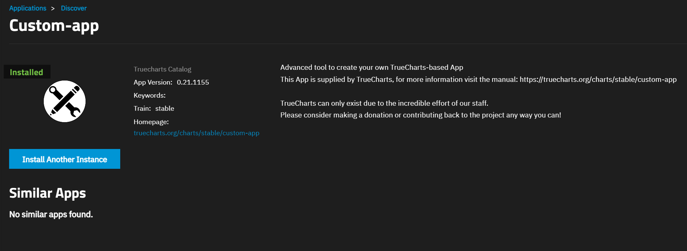
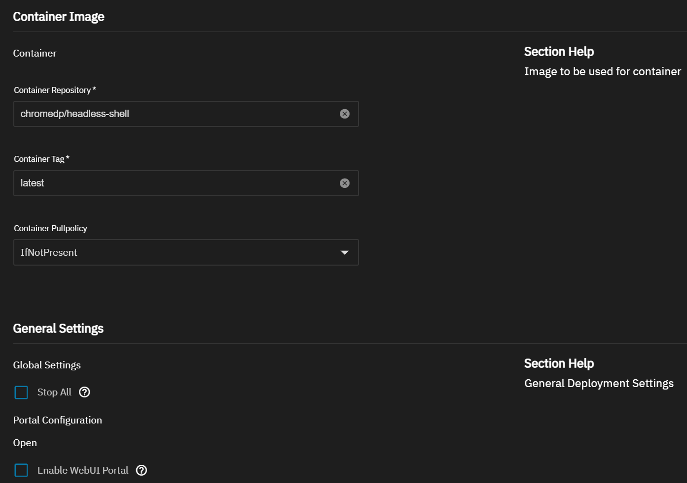
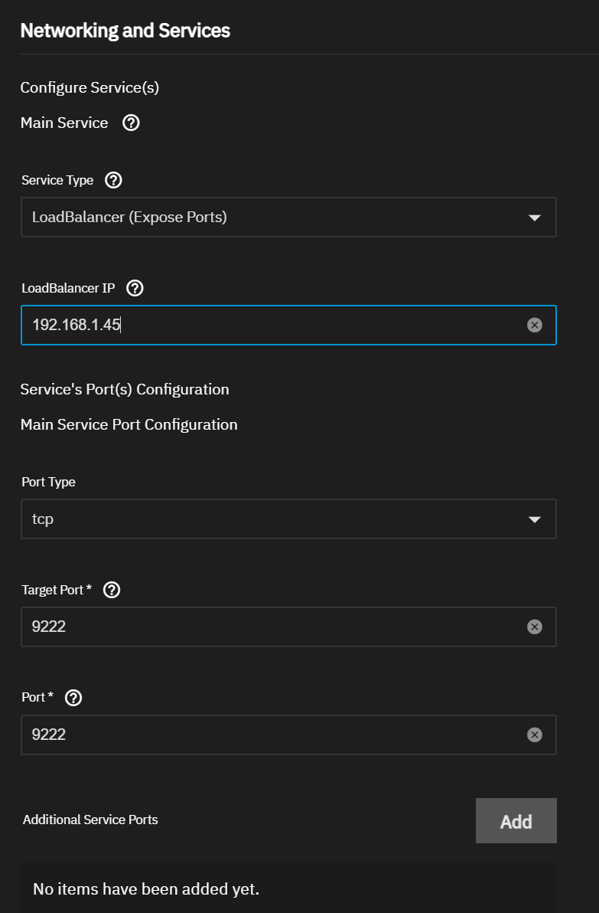
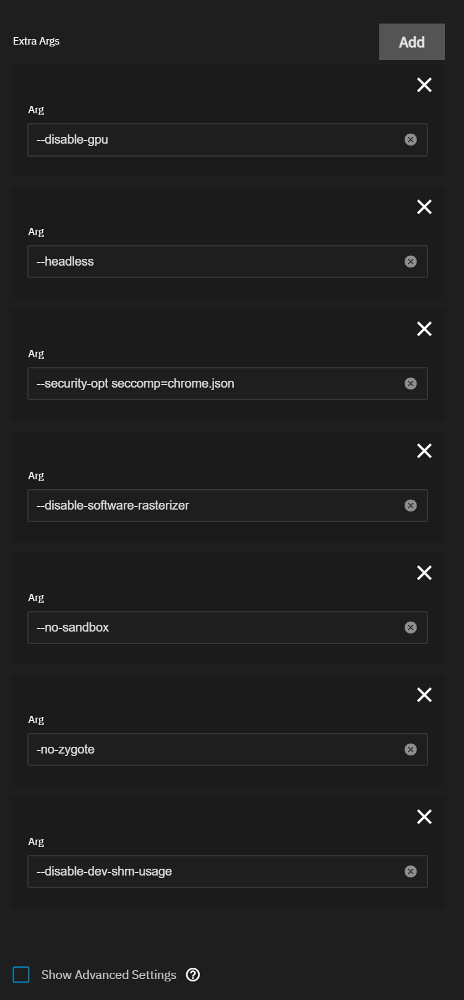

!!! info
    Written by [WiiGe](https://github.com/WiiGe){:target="_blank"}. Originally posted on stashapp/stash discussions[^1].

A way to use CDP scraper on TrueNAS Scale and install chromedp/headless-shell on TrueNAS Scale.

People using stash-app on TrueNAS Scale like me may face the problem that no supported CDP app by truecharts or truenas , and now I found a way to properly run [chromedp/headless-shell](https://github.com/chromedp/docker-headless-shell){:target="_blank"}.

This can be done by custom-app. 

{ width=300 align=center }

According to [docker hub page of chromedp/headless-shell](https://hub.docker.com/r/chromedp/headless-shell/){:target="_blank"}, we start container with  `docker run -d -p 9222:9222 --rm --name headless-shell --shm-size 2G chromedp/headless-shell`, but this's not enough for TrueNAS Scale which run everything with K3s.

In order to run a docker image on K3s, we need to warp docker image with [custom-app](https://truecharts.org/charts/stable/custom-app/){:target="_blank"}, fill the Container Repository with `chromedp/headless-shell` and Container Tag with `latest` so that TrueNAS can pull the image for you. 

{ width=300 align=center }

As for the docker args `docker run -d -p 9222:9222 --rm --name headless-shell --shm-size 2G chromedp/headless-shell`, we need to translate the args and env parameter into custom-app configuration. Under the Workload Settings section of custom-app configuration page, there will be a list of Extra Args, we put `--name headless-shell --shm-size 2G` here in custom-app way.

{ width=200 align=center }

But due to [this issue](https://github.com/Zenika/alpine-chrome/issues/109#issuecomment-1998061550){:target="_blank"}, K3s will report an error of zygote: `ERROR:zygote_host_impl_linux.cc(262)] Failed to adjust OOM score of renderer with pid 28: Permission denied (13)`,  solution is simple - just offer extra args to disable it :`--headless --disable-gpu --no-sandbox  --no-zygote --disable-software-rasterizer --disable-dev-shm-usage`.

`--remote-debugging-address=0.0.0.0 --remote-debugging-port=9222` is not needed because we will set port and ip on Networking and Services section for LoadBalancer (I am using 192.168.1.45 and 9222, change it for your own scenario).

The Networking section and the final Extra Args page should be like this:

{ width=200 align=center }
{ width=200 align=center }

and click Install button then your headless-shell will be good to go.

The last step: just fill stash's CDP setting with `http://192.168.1.45:9222/json/version`(still, change ip:port for your own scenario), and now cdp should be running for you.  

An extra note is Ingress section of custom-app, you may want to use chromedp/headless-shell remotely (e.g. accessing cdp by https://cdp.example.com/json/version), you need to modify the header of request with SetHeader function, see [Host header is specified and is not an IP address or localhost](https://github.com/chromedp/chromedp/issues/505){:target="_blank"}. Obviously stash scraper do not support such operation, write your own scraper in this circumstances.

I just put the info I found together and share here, hope this page help more people who try to use CDP scraper on K3s-based OS.

[^1]: [https://github.com/stashapp/stash/discussions/4719](https://github.com/stashapp/stash/discussions/4719){target=_blank}